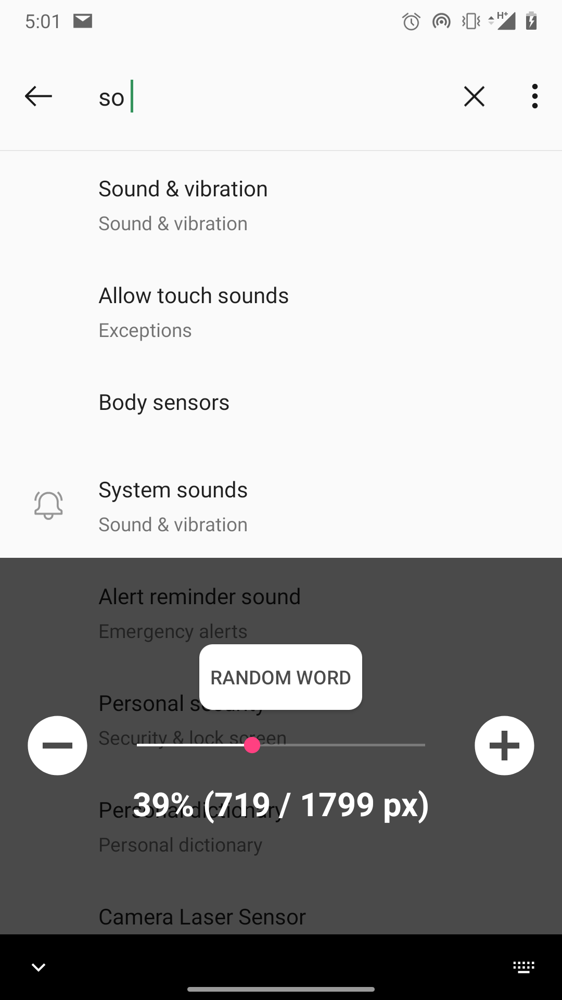
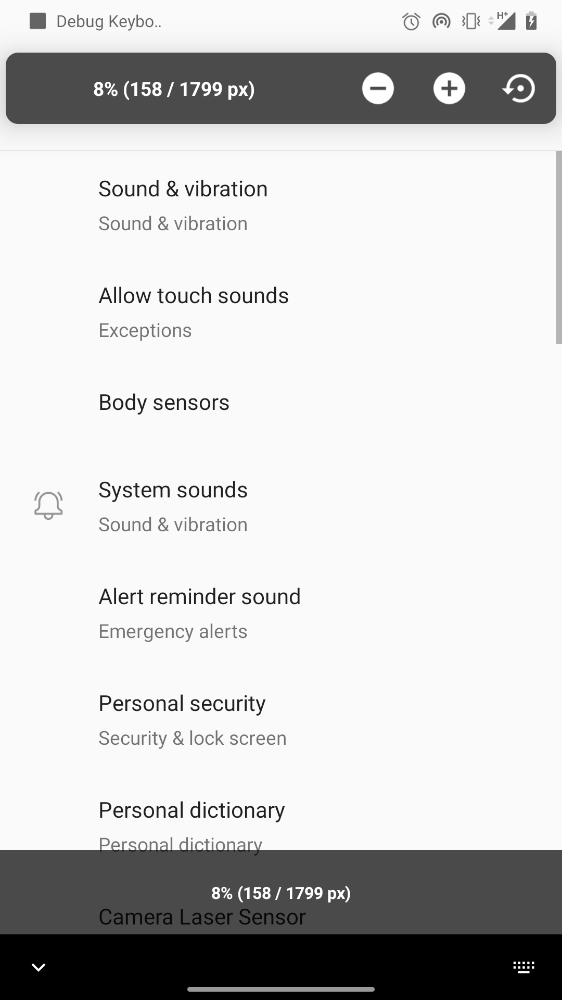

# Debug Keyboard
Keyboard for testing purposes. 

Key features:
* size configuration to check how your UI adjusts to different keyboards.
* transparency to see how your UI acts under opened keyboard


Available in  [Google Play](https://play.google.com/store/apps/details?id=com.testspace.debugkeyboard)

# Screenshots




# How to build
```shell
./gradlew assembleDebug
```